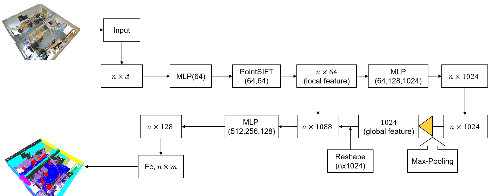
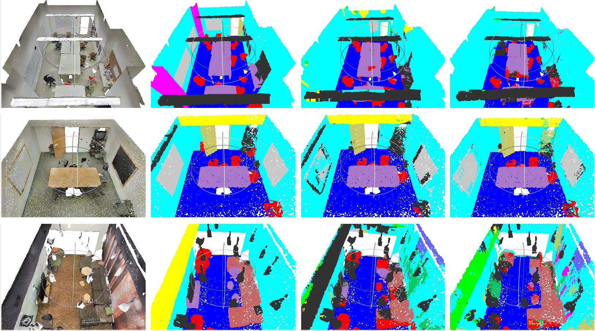

# S-Pointnet

석사 학위 논문 프로젝트이다.

This repository is the implementation of [THIS](http://www.riss.kr/link?id=T15511783) 




## 실행방법 
환경:

- Tensorflow-gpu 1.5.0  
- CUDA 9.0  
- cudnn 7.0.5


1.	Meshlab 설치: 
```
 sudo add-apt-repository ppa:zarquon42/meshlab
 sudo apt-get update
 sudo apt-get install meshlab
```
2.	Tensorflow-gpu 환경안에 include 경로 와 library 경로 찾기:
```
#find tensorflow include path and library paths
 python import tensorflow as tf
 print(tf.sysconfig.get_include())
 print(tf.sysconfig.get_lib())
```
3.	TF operator 컴파일
밑에 4개 파일의 경로를 2에 나온 경로로 수정

### TF operator compiling
```
> cd utils/tf_ops/grouping
> chmod 777 tf_grouping_compile.sh
> ./tf_grouping_compile.sh
> cd utils/tf_ops/interpolation 
> chmod 777 tf_interpolate_compile.sh 
> ./tf_interpolate_compile.sh 
> cd utils/tf_ops/pointSIFT 
> chmod 777 tf_pointSIFT_compile.sh 
> ./tf_pointSIFT_compile.sh 
> cd utils/tf_ops/sampling 
> chmod 777 tf_sampling_compile.sh 
> ./tf_sampling_compile.sh
```
4.	Training data 다운로드

(1)	https://console.cloud.google.com/storage/browser/dataset_cvpr16?pli=1 에Stanford3dDataset_v1.2_Aligned_Version.zip 를 다운로드, data/ 에 압축풀기

(2)	
```
> cd sem_seg/
> sh download_data.sh
```
5.	Training data 예전 처리
```
#data process
> cd sem_seg/
> python collect_indoor3d_data.py
```
6.	학습 시작(train.py 파일 실행 하면, 저절로 model_2.py 파일을 호출한다)
```
#train
> cd sem_seg/ 
> python train.py --log_dir log6 --test_area 6
```
7.	Test 파일 생성
```
#test
> cd sem_seg
> python batch_inference.py --model_path log6/model.ckpt --dump_dir log6/dump –output_filelist log6/output_filelist.txt --room_data_filelist meta/area6_data_label.txt --visu
``` 
위에 명령을 실행하면, sem_seg/log6/dump 폴더안에 가시화 파일이 생성한다.

8.	Test 파일 가시화

Meshlab 실행.
sem_seg/log6/dump 폴더에 있는 xxxx_pred.obj 파일을 연다.

# Acknowledgement
The structure of this codebase is borrowed from [PointNet](https://github.com/charlesq34/pointnet)
